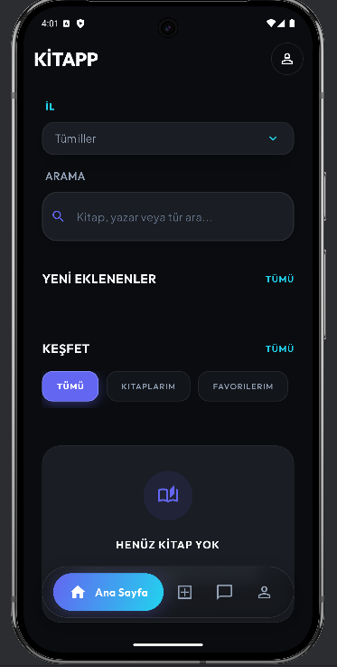
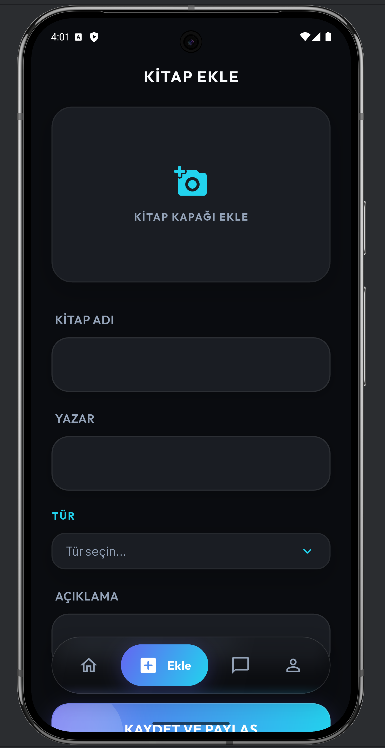
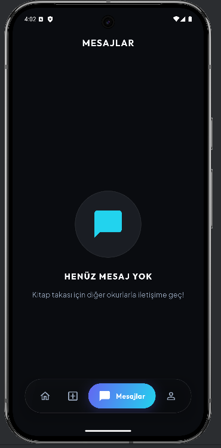
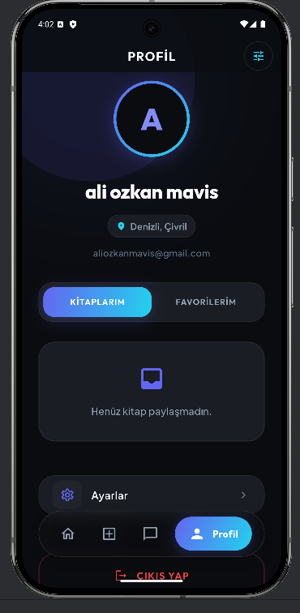
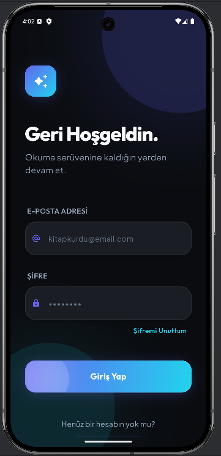
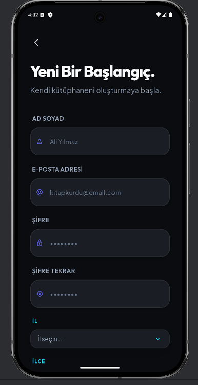

<div align="center">

# 📚 KitApp

### **Quantum Kitap Takas Platformu**

*Flutter & Supabase ile geliştirilmiş fütüristik, minimal kitap takas uygulaması*

[](https://flutter.dev)
[](https://dart.dev)
[](https://supabase.com)
[](LICENSE)

**Kitap paylaşımının geleceğini deneyimleyin** — minimalizm ile işlevselliğin buluştuğu, her etkileşimin kasıtlı olduğu bir platform.

</div>

---

## ✨ Genel Bakış

**KitApp**, kitap severlerin kitapları keşfetme, paylaşma ve takas etme şeklini devrim niteliğinde değiştiren production seviyesinde bir mobil uygulamadır. Mimari hassasiyet ve ayırt edici **"Neo-Ethereal"** tasarım diliyle inşa edilmiş olan uygulama, gelişmiş Flutter geliştirme ile Supabase'in gerçek zamanlı backend altyapısını birleştirir.

### **Tasarım Felsefesi**

- **Kasıtlı Minimalizm**: Her piksel bir amaca hizmet eder. Generic şablonlar yok, görsel gürültü yok.
- **Quantum Estetiği**: Derin uzay renk paletleri, parlak vurgular ve sinematik derinlik.
- **Mekansal Zeka**: Asimetrik düzenler, cömert boşluklar ve beklenmedik kompozisyonlar.

---

## 🎯 Temel Özellikler

### 📖 **Kitap Yönetimi**
- **Akıllı Keşif**: Gelişmiş filtreleme ile kitapları keşfedin (kategori, durum, konum)
- **Konum Bazlı Arama**: Şehir/ilçe filtreleri kullanarak yakınınızdaki kitapları bulun
- **Zengin Detaylar**: Görseller, açıklamalar ve sahip profilleriyle kapsamlı kitap bilgileri
- **Ekle ve Paylaş**: Kitaplarınızı topluluk kütüphanesine sorunsuz bir şekilde ekleyin

### 🔄 **Quantum Takas Sistemi**
- **Çift Yönlü Seçim Arayüzü**: Adil takaslar için her iki taraftan da kitap seçin
- **Gerçek Zamanlı Teklifler**: Özel mesajlarla takas teklifleri gönderin ve alın
- **Durum Takibi**: Takas durumunu izleyin (Beklemede, Kabul Edildi, Tamamlandı)
- **Görsel Takas Akışı**: Animasyonlu geçişlerle seçili kitapları gösteren sezgisel arayüz

### 💬 **Gerçek Zamanlı Mesajlaşma**
- **Anında İletişim**: Kitap sahipleriyle doğrudan sohbet edin
- **Takas Entegrasyonu**: Konuşmalara gömülü takas teklifleri
- **Mesaj Geçmişi**: Zaman damgalı kalıcı sohbet dizileri
- **Bildirim Sistemi**: Yeni mesajlar ve teklifler hakkında güncel kalın

### 👤 **Kullanıcı Deneyimi**
- **Profil Yönetimi**: Fotoğraflar ve konumla profilinizi özelleştirin
- **Kitap Koleksiyonu**: Paylaştığınız tüm kitapları tek bir yerde görüntüleyin
- **Arama ve Filtreleme**: Çoklu filtre seçenekleriyle gelişmiş arama
- **Ayarlar ve Gizlilik**: Kapsamlı uygulama ayarları ve gizlilik kontrolleri

---

## 🏗️ Mimari

### **MVVM Deseni** (Model-View-ViewModel)

```
┌─────────────────────────────────────────┐
│           Screen Katmanı                │
│  (StatefulWidget + BaseView)             │
└──────────────┬──────────────────────────┘
               │
┌──────────────▼──────────────────────────┐
│         View Katmanı                     │
│  (UI Bileşenleri - StatelessWidget)     │
└──────────────┬──────────────────────────┘
               │
┌──────────────▼──────────────────────────┐
│      ViewModel Katmanı                   │
│  (İş Mantığı + Durum Yönetimi)          │
│  - BaseViewModel (extends ChangeNotifier)│
└──────────────┬──────────────────────────┘
               │
┌──────────────▼──────────────────────────┐
│        Service Katmanı                   │
│  (API Çağrıları + Veri İşlemleri)       │
│  - Interface-First Yaklaşımı            │
└──────────────┬──────────────────────────┘
               │
┌──────────────▼──────────────────────────┐
│      Network Katmanı                     │
│  (Supabase Client + Hata Yönetimi)     │
└─────────────────────────────────────────┘
```

### **Temel Mimari Prensipler**

- ✅ **Sorumlulukların Ayrılması**: UI, iş mantığı ve veri katmanları kesin olarak ayrılmıştır
- ✅ **Bağımlılık Enjeksiyonu**: Test edilebilirlik için servisler constructor üzerinden enjekte edilir
- ✅ **Interface-First**: Tüm servisler gevşek bağlantı için interface'leri implement eder
- ✅ **Temel Yapılar**: `BaseViewModel` ve `BaseView` ekranlar arasında tutarlılık sağlar
- ✅ **DTO Deseni**: API iletişimi için tip güvenli veri transfer nesneleri
- ✅ **Hata Yönetimi**: `ErrorHandler` ile merkezi hata yönetimi

---

## 🎨 Tasarım Sistemi

### **Renk Paleti: "Neo-Ethereal"**

```dart
// Ana Palet (Derin Uzay)
primary: #0A0C10        // Derin Obsidiyen
accent: #6366F1         // Elektrik Çivit
accentCyan: #22D3EE      // Neon Cyan

// Arka Plan (Sinematik Derinlik)
backgroundDark: #030406
cardBackground: #111418
glassBackground: rgba(255,255,255,0.1)  // Cam morfizmi

// Metin (Parlak)
textPrimary: #F8FAFC    // Off White
textSecondary: #94A3B8   // Soğuk Slate
```

### **Tipografi**

- **Display Font**: Ayırt edici, karakterli seçimler (Google Fonts)
- **Body Font**: İnce, okunabilir sans-serif
- **Responsive Ölçekleme**: Piksel mükemmel uyarlama için `flutter_screenutil`

### **Mekansal Kompozisyon**

- **Asimetrik Düzenler**: Görsel ilgi için grid kurallarını kıran
- **Cömert Boşluklar**: Kasıtlı nefes alma alanıyla kontrollü yoğunluk
- **Katmanlı Derinlik**: Hiyerarşi için cam morfizmi, gölgeler ve şeffaflık

---

## 🛠️ Teknoloji Yığını

### **Frontend**
- **Flutter** `3.0+` - Cross-platform UI framework
- **Dart** `3.0+` - Tip güvenli dil
- **Provider** `6.1.1` - Durum yönetimi
- **flutter_screenutil** `5.9.0` - Responsive tasarım
- **google_fonts** `6.3.3` - Tipografi

### **Backend & Servisler**
- **Supabase** `2.5.0` - Backend-as-a-Service
  - Gerçek zamanlı veritabanı
  - Kimlik doğrulama
  - Depolama
  - Satır Seviyesi Güvenlik (RLS)

### **UI/UX Kütüphaneleri**
- **cached_network_image** `3.3.0` - Görsel önbellekleme
- **shimmer** `3.0.0` - Yükleme efektleri
- **convex_bottom_bar** `3.2.0` - Navigasyon çubuğu
- **intl** `0.19.0` - Uluslararasılaştırma

### **Geliştirme Araçları**
- **very_good_analysis** `8.0.0` - Linting & analiz
- **flutter_lints** `5.0.0` - Kod kalitesi

---

## 📁 Proje Yapısı

```
lib/
├── base/                          # Çekirdek altyapı
│   ├── constants/                 # Uygulama geneli sabitler
│   │   ├── app_constants.dart     # Renkler, tema
│   │   ├── app_texts.dart         # Metin sabitleri
│   │   └── app_size.dart          # Boyut sabitleri
│   ├── models/                    # Temel modeller
│   │   └── service_response.dart  # Generic API yanıtı
│   ├── services/                  # Çekirdek servisler
│   │   ├── network_service.dart   # HTTP wrapper
│   │   └── error_handler.dart     # Hata yönetimi
│   ├── viewmodels/                # Temel ViewModel'ler
│   │   └── base_view_model.dart   # Temel durum yönetimi
│   └── views/                     # Temel View'lar
│       └── base_view.dart         # Yükleme wrapper'ı
│
├── screens/                       # Özellik modülleri
│   └── [feature_name]/
│       ├── [feature]_screen.dart # Ekran wrapper'ı
│       ├── [feature]_service.dart # İş mantığı
│       ├── viewmodels/            # Özellik ViewModel'leri
│       ├── views/                 # Özellik View'ları
│       └── widgets/               # Özellik özel widget'ları
│
├── domain/                        # Veri katmanı
│   ├── dtos/                      # Veri Transfer Nesneleri
│   ├── models/                    # Domain modelleri
│   └── enums/                     # Numaralandırmalar
│
├── common_widgets/                # Yeniden kullanılabilir bileşenler
│   ├── button_widget.dart
│   ├── text_field_widget.dart
│   └── dropdown_widget.dart
│
└── utils/                         # Yardımcılar
    ├── navigation_util.dart       # Yönlendirme
    ├── network_config.dart        # Ağ kurulumu
    └── extensions/                # Dart extension'ları
```

---

## 🚀 Başlangıç

### **Gereksinimler**

- Flutter SDK `>=3.0.0`
- Dart SDK `>=3.0.0`
- Supabase hesabı (backend için)

### **Kurulum**

1. **Depoyu klonlayın**
   ```bash
   git clone https://github.com/Aliozka-n/kitapp.git
   cd kitapp
   ```

2. **Bağımlılıkları yükleyin**
   ```bash
   flutter pub get
   ```

3. **Ortamı yapılandırın**
   
   `lib/utils/env_config.dart` dosyasını oluşturun:
   ```dart
   class EnvConfig {
     static const String supabaseUrl = 'SUPABASE_URL_BURAYA';
     static const String supabaseAnonKey = 'SUPABASE_ANON_KEY_BURAYA';
   }
   ```

4. **Uygulamayı çalıştırın**
   ```bash
   flutter run
   ```

### **Production için Derleme**

```bash
# Android
flutter build apk --release

# iOS
flutter build ios --release
```

---

## 📱 Ekran Görüntüleri

<div align="center">

**Uygulama içi görseller**

| | | |
|:-----------:|:-----------:|:--------:|
|  |  |  |

| | | |
|:--------:|:-------:|:------:|
|  |  |  |

</div>

---

## 🔐 Güvenlik ve En İyi Uygulamalar

- ✅ **Ortam Değişkenleri**: Hassas kimlik bilgileri güvenli şekilde saklanır
- ✅ **Satır Seviyesi Güvenlik**: Veri koruması için Supabase RLS politikaları
- ✅ **Girdi Doğrulama**: Kapsamlı form doğrulama
- ✅ **Hata Yönetimi**: İç yapıyı açığa çıkarmadan kullanıcı dostu hata mesajları
- ✅ **Tip Güvenliği**: Katı analiz ile null-safe Dart kodu

---

## 🧪 Test

```bash
# Unit testleri çalıştır
flutter test

# Widget testleri çalıştır
flutter test test/widget_test.dart

# Integration testleri çalıştır
flutter test integration_test/
```

---

## 📊 Kod Kalitesi

- **Linting**: Katı kurallarla `very_good_analysis`
- **Mimari**: MVVM deseni zorunlu
- **Dosya Boyutu**: Dosya başına maksimum 200 satır (sert limit: 400)
- **İsimlendirme**: Dosyalar için tutarlı snake_case, değişkenler için camelCase
- **Dokümantasyon**: Kapsamlı satır içi yorumlar

---

## 🎯 Temel Özellik Uygulamaları

### **Takas Sistemi**

Takas özelliği, kullanıcıların şunları yapabileceği **çift yönlü seçim arayüzü** uygular:
1. Koleksiyonlarından bir kitap seçin
2. Diğer kullanıcının koleksiyonundan bir kitap seçin
3. İsteğe bağlı mesajla takas teklifi gönderin
4. Teklif durumunu gerçek zamanlı olarak takip edin

**Teknik Öne Çıkanlar:**
- Durum güncellemeleri için gerçek zamanlı Supabase abonelikleri
- Daha iyi UX için optimistik UI güncellemeleri
- Animasyonlu geçişlerle görsel geri bildirim

### **Konum Bazlı Filtreleme**

Şunları yapan gelişmiş filtreleme sistemi:
- Kitapları şehir ve ilçeye göre filtreler
- RLS ile verimli Supabase sorguları kullanır
- Toplu kullanıcı verisi getirme ile performansı korur

---

## 🤝 Katkıda Bulunma

Katkılarınız memnuniyetle karşılanır! Lütfen şu yönergeleri izleyin:

1. Depoyu fork edin
2. Bir özellik dalı oluşturun (`git checkout -b feature/harika-ozellik`)
3. Değişikliklerinizi commit edin (`git commit -m 'Harika özellik eklendi'`)
4. Dalı push edin (`git push origin feature/harika-ozellik`)
5. Bir Pull Request açın

### **Kod Stili**

- Flutter/Dart stil rehberini takip edin
- Linting için `very_good_analysis` kullanın
- Yeni özellikler için test yazın
- Gerektiğinde dokümantasyonu güncelleyin

---

## 📄 Lisans

Bu proje MIT Lisansı altında lisanslanmıştır - detaylar için [LICENSE](LICENSE) dosyasına bakın.

---

## 👨‍💻 Geliştirici

**Ali Özkan Maviş**

- GitHub: [@Aliozka-n](https://github.com/Aliozka-n)
- LinkedIn: [Ali Özkan Maviş](https://www.linkedin.com/in/ali-%C3%B6zkan-mavis/)

---

## 🙏 Teşekkürler

- **Supabase** harika backend altyapısı için
- **Flutter Ekibi** inanılmaz framework için
- **Tasarım İlhamı**: Neo-fütüristik ve minimal tasarım prensipleri

---

<div align="center">

**Flutter & Supabase ile ❤️ ile geliştirildi**

*"Kitapların yeni evler bulduğu yer"*

⭐ Bu repo'yu ilginç bulduysanız yıldızlayın!

</div>
